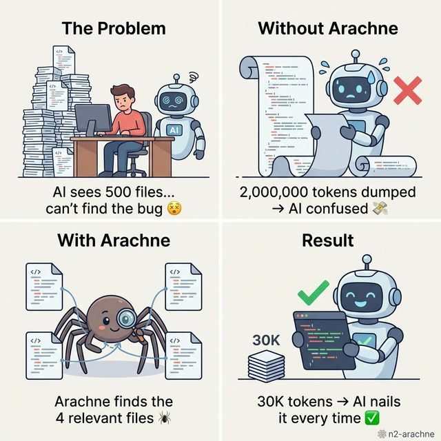
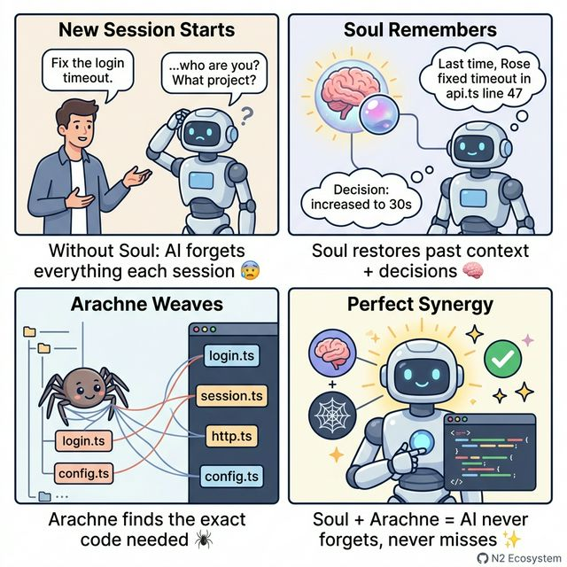

# ️ Arachne (n2-arachne)

[](https://www.npmjs.com/package/n2-arachne)
[](LICENSE)
[](https://www.npmjs.com/package/n2-arachne)
[](https://nodejs.org)

**[한국어](README.ko.md)** | English | **[日本語](README.ja.md)**

---
🔥 **ARACHNE V4.0.0 TITANIUM EDITION** 🔥
> **1GB (1,000,000,000 Bytes) Codebase Search in 0.54 Seconds.**
> _Powered by Zero-Marshaling Architecture. 0 Bytes JS Heap Bloat. No OOM Crashes._
---

> Weave your codebase into the perfect context for AI

### What's New in v4.0 (Titanium Edition)

Arachne has been completely rewritten from JS to strict **TypeScript**, with heavy computational paths natively rewritten in **C++ SIMD (sqlite-vec)** and **Rust (napi-rs)**.

- `TypeScript (Strict)`: 100% type safety with zero runtime regressions.
- `Rust Acceleration`: BM25 **1.3x faster** (memchr SIMD + rayon parallel); BatchCosine **19.9x faster** (96ms → 4.8ms).
- `C++ SIMD Search`: sqlite-vec scans 10,000 × 768D vectors in just **25ms** natively.
- `KV-Cache Integration`: Soul-bridge incremental re-indexing enables sub-second history load on start.
 — like Arachne, the greatest weaver of Greek mythology. ️

##  The Problem — Why AI Gets Your Code Wrong

Imagine going to a doctor and saying **"I have a headache."**

-  **Bad doctor**: reads your entire 500-page medical history, gets confused, prescribes the wrong medicine
-  **Good doctor**: looks at relevant records only — recent symptoms, medications, allergies — and nails the diagnosis

**AI coding assistants are like that bad doctor.**

When your project has 500 files, AI can't read them all. So what happens?

```
 Your Project (500 files, 2M tokens)
│
├── auth/login.ts        ←  The bug is HERE
├── auth/session.ts      ←  login imports this
├── api/http.ts          ←  session imports this
├── utils/config.ts      ← ️ timeout settings live here
│
├── pages/home.tsx       ←  completely irrelevant
├── pages/about.tsx      ←  completely irrelevant
├── components/Button.tsx ←  completely irrelevant
└── ... 493 more files    ←  all irrelevant
```

| Approach | What AI receives | Result |
|----------|-----------------|--------|
|  Dump everything | 2,000,000 tokens | Exceeds context window, AI confused |
|  Random files | ~50,000 tokens | Misses critical code, wrong fix |
|  **Arachne** | **30,000 tokens** (4 relevant files) | Precise fix, every time |

> **Tokens** = units of text AI reads. More tokens = more cost, slower, less accurate.
> AI has a limited "context window" — like a desk that can only hold so many papers.

###  Real-World Benchmark (N2 Browser — 3,219 files)

| Metric | Value |
|--------|:-----:|
| **Project size** | 3,219 files, **4.68M tokens** |
| **Arachne output** | **14,074 tokens** |
| **Compression** | **333x** (99.7% reduction) |
| **Index time** | 627ms (incremental: 0ms) |
| **DB size** | 24 MB |

> *Measured on a real production project. Arachne delivered exactly what AI needed — 333x less data, same accuracy.*

---

## ️ The Solution — Arachne Picks Exactly What AI Needs

Arachne is a **local MCP server** that acts like that good doctor. It reads your entire codebase once, understands the structure, and **only sends what's relevant** to AI.

```
You: "Fix the login timeout bug"
                │
                ▼
┌──────────────────────────────────────────────────────┐
│  ️ Arachne: "I'll find exactly what you need"      │
│                                                      │
│  L1  Project tree (so AI knows the structure)      │
│  L2  login.ts (the file you're working on)         │
│  L3  http.ts, session.ts (found via search +       │
│        dependency chain: login → session → http)     │
│  L4 ️ config.ts (frequently accessed, has timeout)  │
│                                                      │
│  → 30,000 tokens of perfectly curated context        │
└──────────────────────────────────────────────────────┘
                │
                ▼
        AI generates accurate fix 
```

**No manual file selection. No prompt engineering. Just ask.**

---

### Why Arachne?

-  **98.5% token savings** — 30K instead of 2M tokens. Real money saved on API calls
-  **Beats "Lost in the Middle"** — Smart output ordering (L1→L3→L4→L2) keeps critical code where AI pays attention ([research-backed](https://arxiv.org/abs/2307.03172))
-  **Zero external deps** — No Docker, no cloud, no API keys. Just `npm install` and go
-  **Blazing fast** — 21 files indexed in 12ms. Incremental updates in sub-second
-  **Ultralight** — Only 3 deps: `better-sqlite3`, `sqlite-vec`, `zod`. No bloat
- 🆓 **100% free & open source** — Apache-2.0, no hidden costs, no telemetry
-  **Plug & play** — Add MCP config → done. Zero code changes to your project
-  **Multi-language** — Follows import chains across JS/TS, Python, Rust, Go, **Java**
-  **Ollama optional** — Works perfectly without Ollama (BM25 search). Add Ollama for bonus semantic search

### ️ Arachne in 4 Panels



###  Soul + Arachne Synergy



##  Key Features

| Feature | Description |
|---------|-------------|
|  **MCP Standard** | Works with Claude, Gemini, GPT, Ollama — any AI provider |
|  **Local-First** | All indexing in local SQLite. Zero data leaves your machine |
|  **Incremental** | Only re-indexes changed files. Sub-second updates |
|  **Hybrid Search** | BM25 keyword + semantic vector search (Ollama embeddings) |
| ️ **4-Layer Assembly** | Smart context paging within token budget |
|  **Dependency Graph** | Follows import chains across JS/TS, Python, Rust, Go, **Java** |
| ️ **Backup & Restore** | SQLite online backup with in-backup search |

## ️ Architecture: 4-Layer Context Assembly

```
┌─────────────────────────────────────────────┐
│              Token Budget (e.g. 30K)        │
├────────────┬────────────────────────────────┤
│ L1: Fixed  │ File tree overview (10%)       │
│ (always)   │ Project structure snapshot     │
├────────────┼────────────────────────────────┤
│ L2: Short  │ Current file + recent (20%)   │
│ (context)  │ What you're working on now     │
├────────────┼────────────────────────────────┤
│ L3: Assoc  │ Search + dependencies (50%)  │
│ (relevant) │ BM25 + semantic + dep chain   │
├────────────┼────────────────────────────────┤
│ L4: Spare  │ Frequently accessed (20%)     │
│ (backup)   │ Files you use most            │
└────────────┴────────────────────────────────┘

Output order: L1 → L3 → L4 → L2  (mitigates "Lost in the Middle")
```

##  Semantic Search (Optional, Zero Lock-in)

When Ollama is available, Arachne upgrades from keyword-only to **hybrid search**:

```
BM25 Score (keyword) ──┐
                       ├── Weighted Merge (α=0.5) → Best Results
Cosine Similarity ─────┘
(nomic-embed-text 768D)
```

- **sqlite-vec** for SIMD-accelerated (AVX2/SSE2/Neon) KNN vector search
- **768-dimensional** embeddings via Ollama `nomic-embed-text` — runs 100% local
- **Graceful degradation**: No Ollama? Falls back to BM25-only. **Zero crashes. Always works.**
- Enable in config: `embedding.enabled = true`
- Vector storage: ~3KB per chunk. 5000 chunks = just 15MB on disk

### Benchmark (v4.0)

All benchmarks run on AMD Ryzen 5 5600G, Node v24, Windows x64.
Three engines: **TypeScript** (V8 JIT), **Rust** (napi-rs), **sqlite-vec** (C++ SIMD).

#### Search Performance (10,000 chunks / 768D vectors)

| Search Mode | Engine | Performance | Notes |
|-------------|--------|:-----------:|-------|
| **Keyword** | 🦀 Rust BM25 (memchr + rayon) | **4.98 ms** / query | 1.3x faster than TS |
| **Keyword** | SQLite LIKE | **0.021 ms** / query | DB index, fastest |
| **Semantic KNN** | sqlite-vec (C++ SIMD) | **29.52 ms** / query | 10K × 768D in-DB native scan |
| **Batch Cosine** | 🦀 Rust (napi-rs) | **4.91 ms** / query | *Legacy*: 22.3x faster, but triggers IPC heap spikes |

#### Architecture Pivot: 1GB+ Scale Stability

While **Rust BatchCosine** achieved blazing speeds (4.9ms), loading millions of vectors across the Node.js FFI boundary triggered massive V8 Garbage Collection (GC) pauses and Heap OOM crashes on 1GB+ codebases. 

To achieve 100% stability on large-scale datasets, Arachne v4.0 enforces a **Zero-Marshaling Policy**:
- **Semantic Search**: Delegated 100% to **sqlite-vec**. It takes ~29ms (slightly slower than Rust), but memory overhead is **0 bytes in JS**. The Node event loop remains completely unblocked.
- **Keyword Search**: Powered by the **Rust BM25 Cache**. Chunk data is cached heavily in the Rust heap, crossing the FFI boundary only for small queries and resulting IDs.

<details>
<summary>Run benchmarks yourself</summary>

```bash
npm run build && node test/bench-hybrid-engine.js   # Raw engine comparison
npm run build && node test/bench-10mb.js             # Memory scale impact
```
Results saved to `data-hybrid-bench/benchmark-report.json`.
</details>


##  Java Support — Built for Enterprise

Arachne provides **first-class Java support**, designed for large-scale enterprise codebases (5M+ LOC):

| Feature | Description |
|---------|-------------|
| **Smart Chunking** | Detects `class`, `interface`, `enum`, `method`, `@interface` (annotations) |
| **Large Class Splitting** | Classes over 500 tokens are **automatically sub-chunked** into individual methods |
| **Import Resolution** | Parses `import com.example.Service` and `import static org.junit.Assert.*` |
| **Access Modifiers** | Handles `public`, `private`, `protected`, `abstract`, `final`, `synchronized` |
| **Generics** | Correctly processes `<T extends Comparable<T>>` and complex generic types |
| **Spring/JUnit** | Tested with Spring Boot `@RestController`, JUnit5 static imports, Mockito |
| **Binary Exclusion** | Automatically ignores `.class`, `.jar`, `.war`, `.ear` files |

### How Large Class Sub-Chunking Works

```
// 500+ token class → automatically split into methods
public class UserService {       // ← detected as container
    public User findById() {}    // ← sub-chunk 1
    public List<User> findAll()  // ← sub-chunk 2
    public User save() {}        // ← sub-chunk 3
    // ... fields, constructor   // ← remainder chunk
}

// Small class (<500 tokens) → kept as single chunk (no overhead)
public class TinyDTO { ... }     // ← single chunk, efficient
```

>  **Why this matters for 5M LOC projects**: A single Java class can have 50+ methods spanning thousands of lines. Without sub-chunking, AI would receive the entire class as one blob. With Arachne, AI gets individual methods — enabling precise, targeted code generation.

###  Token Impact: Less Is More

```
Without sub-chunking:
  AI asks: "Fix the findById bug"
  → BM25 hits UserService class
  → Entire class sent: 6,000 tokens  

With sub-chunking:
  AI asks: "Fix the findById bug"
  → BM25 hits findById() method only
  → Just the method sent: 80 tokens    75x savings!
```

> Sub-chunking doesn't cost extra — it **saves** tokens by sending only what's relevant instead of entire classes.

## ️ Stability: 128 Tests, Zero Failures

Arachne is built for production. Every edge case is tested:

| Category | What's Tested |
|----------|---------------|
|  SQL Injection | 5 attack patterns including Bobby Tables |
| ️ Null/Empty Input | null, undefined, empty string → safe return |
|  Huge Input | 10KB queries → no crash |
|  Special Characters | Unicode, emoji, regex chars → handled |
|  Ollama Disconnect | Bad endpoint → graceful BM25 fallback |
|  Idempotency | Triple re-indexing → same result |
|  Extreme Budgets | Budget 0, 1, 1M → all safe |
|  Edge topK | topK = -1, 0, 99999 → no crash |
|  Schema Safety | Triple init → data survives |

```
Phase 1 (Indexing/Search):    15/15 
Phase 2 (Assembly/Deps):      26/26 
Phase 2 (KV-Cache Bridge):   33/33 
Phase 3 (Semantic/Hybrid):    10/10 
Stability (Reddit-proof):     44/44 
─────────────────────────────────────
Total:                       128/128 
```

##  Installation

>  **Pro tip**: The best way to install? Just ask your AI agent: *"Install n2-arachne for me."* It knows what to do. ️

```bash
npm install n2-arachne
```

### MCP Config (Claude Desktop / Cursor / etc.)

```json
{
  "mcpServers": {
    "n2-arachne": {
      "command": "node",
      "args": ["/path/to/n2-arachne/index.js"],
      "env": {
        "ARACHNE_PROJECT_DIR": "/path/to/your/project"
      }
    }
  }
}
```

##  Configuration

Create `config.local.js` in the Arachne directory:

```javascript
module.exports = {
    projectDir: '/path/to/your/project',
    dataDir: './data',

    indexing: {
        autoIndex: true,
        maxFileSize: 512 * 1024,    // 512KB max per file
    },

    // Enable semantic search (requires Ollama)
    embedding: {
        enabled: true,              // default: false
        provider: 'ollama',
        model: 'nomic-embed-text',
        endpoint: 'http://localhost:11434',
    },

    assembly: {
        defaultBudget: 30000,       // tokens
    },
};
```

##  Usage (MCP Tool)

Arachne registers a single MCP tool `n2_arachne` with these actions:

| Action | Description |
|--------|-------------|
| `search` | BM25 keyword search (+ semantic if enabled) |
| `assemble` | 4-Layer context assembly within token budget |
| `index` | Index/re-index project files |
| `status` | Show indexing stats + embedding status |
| `files` | List indexed files |
| `backup` | Create/list/restore backups |

### Example: Assemble Context

```json
{
  "action": "assemble",
  "query": "HTTP request timeout error handling",
  "activeFile": "lib/executor.js",
  "budget": 20000
}
```

##  Connect with Soul / QLN

Arachne works great standalone, but becomes far more powerful with **Soul** (session memory) and **QLN** (tool routing).

Setup is simple — just register them together in your MCP config:

### Soul + Arachne Together

```json
{
  "mcpServers": {
    "n2-soul": {
      "command": "node",
      "args": ["/path/to/n2-soul/index.js"]
    },
    "n2-arachne": {
      "command": "node",
      "args": ["/path/to/n2-arachne/index.js"],
      "env": {
        "ARACHNE_PROJECT_DIR": "/path/to/your/project"
      }
    }
  }
}
```

>  **Zero extra config needed!** Register both servers in the same MCP config and AI automatically uses both tools.
> - `Soul` remembers past session work and decisions
> - `Arachne` finds the exact code and delivers it to AI
> - Result: AI picks up right where you left off — no "what was I working on?"

### Full N2 Stack (Soul + Arachne + QLN)

```json
{
  "mcpServers": {
    "n2-soul": {
      "command": "node",
      "args": ["/path/to/n2-soul/index.js"]
    },
    "n2-arachne": {
      "command": "node",
      "args": ["/path/to/n2-arachne/index.js"],
      "env": {
        "ARACHNE_PROJECT_DIR": "/path/to/your/project"
      }
    },
    "n2-qln": {
      "command": "node",
      "args": ["/path/to/n2-qln/index.js"]
    }
  }
}
```

> Add QLN and even with 100+ MCP tools, AI automatically finds and uses only what it needs via QLN's semantic routing.

##  N2 Ecosystem — Better Together

| Package | Role | npm | Standalone |
|---------|------|-----|:----------:|
| **QLN** | Tool routing (1000+ tools → 1 router) | `n2-qln` |  |
| **Soul** | Agent memory & session management | `n2-soul` |  |
| **Ark** | Security policies & code verification | `n2-ark` |  |
| **Arachne** | Code context auto-assembly ️ | `n2-arachne` |  |

> Every package works **100% standalone**. But when combined, magic happens:

###  Synergy: How They Work Together

```
User: "Fix the login timeout bug"
     │
     ▼
┌─── QLN (Router) ──────────────────────────────────────┐
│ 1000+ tools → Semantic routing finds:                 │
│   → n2_arachne.assemble (context)                     │
│   → n2_arachne.search (code search)                   │
│ Token cost: 2 tool defs instead of 1000+              │
└────────────────┬──────────────────────────────────────┘
                 │
                 ▼
┌─── Arachne (Context) ─────────────────────────────────┐
│ L1: Project tree overview                              │
│ L2: auth/login.ts (current file)                       │
│ L3: BM25 + semantic search → timeout-related code      │
│     + dependency chain: login.ts → api.ts → http.ts    │
│ L4: Frequently accessed config files                   │
│ → 30K tokens of perfectly curated context              │
└────────────────┬──────────────────────────────────────┘
                 │
                 ▼
┌─── Soul (Memory) ─────────────────────────────────────┐
│ "Last session, Rose fixed a similar timeout in         │
│  api.ts line 47. Decision: increased to 30s."          │
│ → Past context + decisions + handoff notes             │
│ → KV-Cache: instant session restoration                │
└────────────────┬──────────────────────────────────────┘
                 │
                 ▼
┌─── Ark (Security) ────────────────────────────────────┐
│  No hardcoded credentials in generated code          │
│  Timeout value from config, not magic number         │
│  Error handling follows project conventions           │
│ → Code verification before commit                      │
└───────────────────────────────────────────────────────┘
```

###  Solo vs Combined

| Scenario | Solo | Combined |
|----------|------|----------|
| **Token usage** | AI sees all 1000+ tools | QLN routes → AI sees 2-3 tools |
| **Context quality** | AI guesses which files matter | Arachne provides exact relevant code |
| **Memory** | AI forgets everything each turn | Soul remembers past sessions + decisions |
| **Code safety** | No guardrails | Ark validates before deploy |
| **Setup** | Each tool works independently | Zero extra config — auto-detection |

###  Real-World Impact

- **QLN + Arachne**: QLN routes the request to Arachne → Arachne provides perfect context → AI generates accurate code on the first try. No more "which file was that in?"
- **Soul + Arachne**: Soul remembers what you worked on last session → Arachne indexes those files with higher priority → continuity across sessions
- **Ark + Arachne**: Arachne provides code context → AI generates code → Ark validates it follows project patterns. Catch bugs before they ship.
- **All 4 together**: The AI becomes a team member who **remembers everything**, **finds anything**, **uses the right tools**, and **follows the rules**.

##  License

This project is dual-licensed:

| Use Case | License | Cost |
| --- | --- | --- |
| Personal / Educational | Apache 2.0 | Free |
| Open-source (non-commercial) | Apache 2.0 | Free |
| Commercial / Enterprise | Commercial License | Contact us |

See [LICENSE](LICENSE) for full details.

##  Star History

No coffee? A star is fine too

[](https://star-history.com/#choihyunsus/n2-arachne&Date)

---

*Arachne — the greatest weaver. Your code, perfectly woven.* ️
